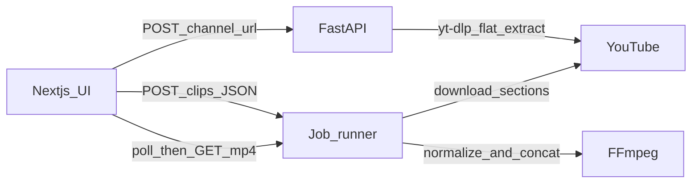

# CompCreator Implementation Plan

Personal-use CompHero-style app. Empty repo at `/Users/rgalpin/Desktop/CompCreator`. First execution step writes this plan to [PLAN.md](PLAN.md), then builds the app from it.

YouTube’s terms restrict downloading. This app is for the user’s own personal compilations of videos they have the right to use. No upload, OAuth, or scheduled scraping in v1 — those stay as stubs.

## Decisions

- **Trim and concat engine:** `yt-dlp` download-sections plus FFmpeg. MoviePy stays out of the hot path (slower, worse at stream concat).
- **Export is async.** `POST /compilations` returns a job id immediately. The UI polls until the MP4 is ready, then downloads it. Cloud Run freezes CPU after the HTTP request ends unless CPU is always allocated, so the Dockerfile and README will document `--no-cpu-throttling`, a long request timeout, and 4Gi memory.
- **Download link:** `GET /compilations/{job_id}/download` streams the finished MP4. Files live under a temp jobs directory on the instance. A GCS signed-URL stub is commented for a later Cloud Run deploy.
- **No auth.** Single-user local / personal Cloud Run service.
- **Channel listing cap:** default 24 most recent uploads, overridable with `?limit=` (max 50).
- **Clip guardrails:** at least 1 clip, start before end, each clip at most 10 minutes, total timeline at most 30 minutes.

## Architecture



## Repository layout

```
CompCreator/
  PLAN.md
  README.md
  .gitignore
  docker-compose.yml
  frontend/                 # Next.js App Router, Vercel-ready
    app/page.tsx
    app/layout.tsx
    app/globals.css
    components/ChannelForm.tsx
    components/VideoGrid.tsx
    components/Timeline.tsx
    components/ExportBar.tsx
    lib/api.ts
    lib/time.ts
  backend/
    Dockerfile
    requirements.txt
    app/main.py
    app/config.py
    app/models.py
    app/routers/channels.py
    app/routers/compilations.py
    app/services/ytdlp_service.py
    app/services/ffmpeg_service.py
    app/services/job_store.py
    app/stubs/youtube_upload.py
    app/stubs/autopilot.py
```

## Backend

Python 3.12, FastAPI, `yt-dlp`, image also installs `ffmpeg`.

**`POST /api/channels`** body `{ "url": "<channel url>" }`.

- Accept `@handle`, `/channel/UC…`, `/c/…`, `/user/…`, and `/videos` URLs.
- Resolve to the uploads tab and `extract_info(..., download=False)` with flat extraction.
- Return `{ videos: [{ video_id, title, thumbnail, duration_seconds, url }] }`.
- Map yt-dlp failures to HTTP 400 with a short message.

**`POST /api/compilations`** body:

```json
{
  "clips": [
    { "video_id": "abc", "title": "…", "start": "00:15", "end": "00:45", "order": 0 }
  ]
}
```

- Validate times (`mm:ss` or `hh:mm:ss`) and the duration caps.
- Create a job (`queued` → `downloading` → `concatenating` → `ready` | `failed`) and start work in a background task.
- Per clip: `yt-dlp` with `--download-sections "*START-END"` into the job dir (section times in seconds).
- Normalize every clip to 1920x1080, H.264, AAC 48kHz stereo, yuv420p, `+faststart`, so concat does not break on mixed YouTube streams.
- Concat with the FFmpeg concat demuxer (`-c copy`) into `compilation.mp4`.
- **`GET /api/compilations/{job_id}`** returns status, progress string, and `download_url` when ready.
- **`GET /api/compilations/{job_id}/download`** returns the file as `video/mp4`.

CORS allows `CORS_ORIGINS` (default `http://localhost:3000`).

**Stubs (not wired to routes):**

- [backend/app/stubs/youtube_upload.py](backend/app/stubs/youtube_upload.py) — commented YouTube Data API OAuth + resumable upload outline.
- [backend/app/stubs/autopilot.py](backend/app/stubs/autopilot.py) — commented cron / Cloud Scheduler “idea scout” outline.

**[backend/Dockerfile](backend/Dockerfile):** `python:3.12-slim`, install `ffmpeg`, `pip install -r requirements.txt`, run `uvicorn app.main:app --host 0.0.0.0 --port 8080`. Cloud Run expects port 8080.

## Frontend

Next.js App Router, Tailwind, shadcn (`button`, `input`, `card`, `scroll-area`). `output` stays default (Vercel). API base is `NEXT_PUBLIC_API_URL` (default `http://localhost:8000`).

Single page:

1. Channel URL field and “Load videos”.
2. Responsive thumbnail grid. Click adds that video to the timeline once (second click does not duplicate).
3. Timeline list: title, Start, End, remove, up/down reorder. Order is the list index sent as `order`.
4. “Export compilation” posts the payload, polls every 2s, shows status text, then a download link to the MP4 endpoint.

Client-side time checks mirror the backend so bad ranges fail before the request.

## Local run and deploy notes

- [docker-compose.yml](docker-compose.yml): backend on port 8000 mapped to container 8080; frontend via `npm run dev` on the host (or a compose service).
- README: install FFmpeg + Python locally **or** use compose; `cd frontend && npm install && npm run dev`; env examples; Cloud Run `gcloud run deploy` flags (CPU always allocated, timeout 3600, memory 4Gi, unauthenticated for personal use); Vercel env `NEXT_PUBLIC_API_URL`.

## Build order

1. Write [PLAN.md](PLAN.md) and root `.gitignore` / README skeleton.
2. Backend models, config, yt-dlp channel listing, job runner, FFmpeg concat, routes, stubs, Dockerfile, requirements.
3. Frontend scaffold (Next.js, Tailwind, shadcn), API client, page UI.
4. docker-compose and README run/deploy steps.
5. Smoke-check backend import and a time-parser unit check; start both servers and click through load → add clip → invalid time → export only if a short public video is practical. If a full YouTube download is too slow or blocked, verify the API contract and UI states and say what was not run end-to-end.
